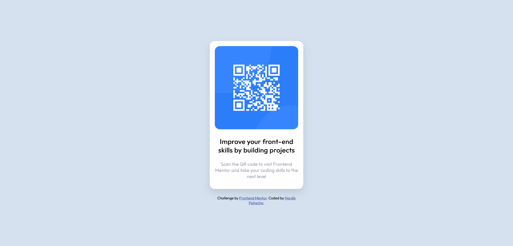

# Frontend Mentor - QR code component solution

This is a solution to the [QR code component challenge on Frontend Mentor](https://www.frontendmentor.io/challenges/qr-code-component-iux_sIO_H). Frontend Mentor challenges help you improve your coding skills by building realistic projects. 

## Table of contents

- [Overview](#overview)
  - [Screenshot](#screenshot)
  - [Links](#links)
- [My process](#my-process)
  - [Built with](#built-with)
  - [What I learned](#what-i-learned)
  - [Continued development](#continued-development)
  - [Useful resources](#useful-resources)
- [Author](#author)
- [Acknowledgments](#acknowledgments)

**Note: Delete this note and update the table of contents based on what sections you keep.**

## Overview

### Screenshot




### Links

- Solution URL: [Add solution URL here](https://your-solution-url.com)
- Live Site URL: [Add live site URL here](https://your-live-site-url.com)

## My process

### Built with

-Responsive Design: Uses media queries to adapt layout for different screen sizes (mobile-first).
-CSS Flexbox: Centers the card on the screen using display: flex.
-Box Model: Utilizes padding, margin, and box-sizing for spacing and layout consistency.
-Card Structure: Divides content into a QR image section and a text section.
-Typography & Spacing: Adjusts font sizes, spacing, and line-height for readability.
-Shadows & Borders: Adds depth and style using box shadows and border-radius.


### What I learned

Use this section to recap over some of your major learnings while working through this project. Writing these out and providing code samples of areas you want to highlight is a great way to reinforce your own knowledge.

To see how you can add code snippets, see below:

```html
<div class="container">
      
      <div class="main-div">
        <h3>Improve your front-end skills by building projects</h3>
        <p>
          Scan the QR code to visit Frontend Mentor and take your coding skills
          to the next level
        </p>
      </div>
    </div>
```
```css
body {
  display: flex;
  margin: 0;
  flex-direction: column;
  justify-content: center;
  align-items: center;
  height: 100dvh;
  font-family: "Outfit", sans-serif;
  background-color: #d5e1ef;
}
.container {
  max-width: 250px;
  height: min-content;
  justify-content: center;
  align-items: center;
  border-radius: 15px;
  padding: 15px;
  background-color: #fff;
  box-shadow: 0 10px 20px rgba(0, 0, 0, 0.1);
}
.main-div {
  text-align: center;
}

h3 {
  font-weight: 700;
  font-size: 20px;
}
p {
  font-weight: 400;
  color: #9a9ea8;
  font-size: 14px;
}

.cardpic {
  width: 100%;
  max-width: 250px;
  max-height: 250px;
  border-radius: 15px;
}
footer {
  margin-top: 20px;
  max-width: 250px;
  font-size: 12px;
}
```


## Author

- Frontend Mentor - [@hardik1452](https://www.frontendmentor.io/profile/hardik1452)
- Instagram - [@i.m.hrdik](https://www.instagram.com/i.m.hrdik/)

